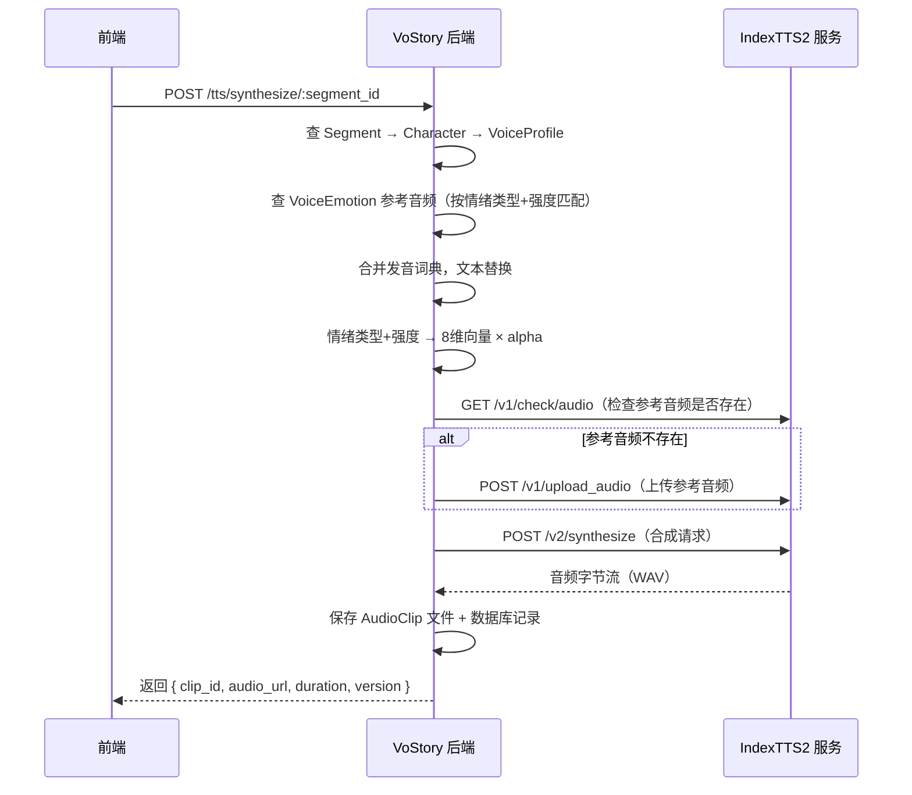

# IndexTTS2 TTS 对接实现文档

## 概述

VoStory 通过 HTTP 协议对接外部 IndexTTS2 服务，实现零样本语音克隆、情绪控制、发音词典替换等功能。用户在"AI 配置 > TTS 提供商"中配置 IndexTTS2 服务地址即可使用。

---

## 架构流程



---

## IndexTTS2 HTTP 协议

VoStory 后端调用的 IndexTTS2 HTTP 端点（参考 SonicVale 项目的 `TTSEngine` 实现）：

| 方法 | 端点 | 请求体 | 响应 |
|------|------|--------|------|
| POST | `/v2/synthesize` | JSON: `{text, audio_path, emo_vector?, emo_text?}` | 音频字节流 |
| GET | `/v1/check/audio?file_name=xxx` | - | `{exists: bool}` |
| POST | `/v1/upload_audio` | multipart: `audio` 文件 + `full_path` | JSON |
| GET | `/v1/models` | - | 模型信息 |

---

## 后端文件清单

### 新增文件

| 文件路径 | 说明 |
|----------|------|
| `internal/tts/client.go` | IndexTTS2 HTTP 客户端，封装 Synthesize / CheckAudioExists / UploadAudio / EnsureAudioUploaded / TestConnection |
| `internal/repository/vs_audio_clip.go` | AudioClip 数据访问层 — Create / FindCurrentBySegmentID / FindCurrentBySegmentIDs / SetAllNonCurrent / GetMaxVersion |
| `internal/repository/vs_voice_emotion.go` | VoiceEmotion 数据访问层 — CRUD + FindByMatch(profile, type, strength) |
| `internal/service/vs_voice_emotion.go` | VoiceEmotion 业务层 — 完整 CRUD |
| `internal/handler/vs_voice_emotion.go` | VoiceEmotion HTTP 处理层 — 6 个 REST 端点 |
| `api/v1/vs_voice_emotion.go` | VoiceEmotion DTO（Create/Update/Detail/ListQuery） |
| `internal/service/vs_tts_synthesize.go` | **TTS 合成编排服务**（核心），包含情绪向量映射、发音词典替换、完整合成流程 |
| `internal/handler/vs_tts_synthesize.go` | TTS 合成 HTTP 处理层 |
| `api/v1/vs_tts_synthesize.go` | TTS 合成响应 DTO |

### 修改文件

| 文件路径 | 修改内容 |
|----------|----------|
| `cmd/server/wire/wire.go` | repositorySet / serviceSet / handlerSet 注册新模块 |
| `internal/server/http.go` | 添加 handler 参数 + 路由注册（voice-emotion CRUD、tts synthesize/audio） |
| `api/v1/vs_script_segment.go` | DetailResponse 增加 `has_audio` + `audio_url` 字段 |
| `internal/service/vs_script_segment.go` | FindByChapterID 批量查询 AudioClip，填充 has_audio/audio_url |

---

## API 端点

### TTS 合成

| 方法 | 路径 | 权限 ID | 说明 |
|------|------|---------|------|
| POST | `/api/v1/tts/synthesize/:segment_id` | `tts:synthesize` | 合成单个片段语音，返回音频信息 |
| GET | `/api/v1/tts/audio/:segment_id` | `tts:audio` | 获取片段当前版本音频 |

**TTSSynthesizeResponse**:

```json
{
    "clip_id": 1,
    "audio_url": "storage/audio/1/42_v1.wav",
    "duration": 0,
    "version": 1
}
```

### VoiceEmotion CRUD

| 方法 | 路径 | 权限 ID | 说明 |
|------|------|---------|------|
| GET | `/api/v1/voice-emotion/:id` | `voice-emotion:detail` | 获取详情 |
| GET | `/api/v1/voice-emotion/list` | `voice-emotion:list` | 分页列表 |
| POST | `/api/v1/voice-emotion` | `voice-emotion:add` | 创建 |
| PUT | `/api/v1/voice-emotion/:id` | `voice-emotion:edit` | 更新 |
| DELETE | `/api/v1/voice-emotion/:id` | `voice-emotion:remove` | 删除 |
| GET | `/api/v1/common/voice-emotion/profile/:voice_profile_id` | - | 按声音配置查询（无需权限） |

### ScriptSegment 列表增强

`GET /api/v1/common/script-segment/chapter/:chapter_id` 的响应现在包含：

```json
{
    "id": 88,
    "has_audio": true,
    "audio_url": "storage/audio/1/88_v1.wav",
    "..."
}
```

前端通过 `has_audio` 判断是否显示播放按钮，无需单独请求每个片段的音频状态。

---

## 情绪映射

### 7 种情绪 → IndexTTS2 8 维向量

IndexTTS2 的情绪向量维度顺序为：`[happy, angry, sad, afraid, disgusted, melancholic, surprised, calm]`

| VoStory 情绪 | IndexTTS2 向量 |
|-------------|---------------|
| neutral | `[0, 0, 0, 0, 0, 0, 0, 1.0]` |
| happy | `[1.0, 0, 0, 0, 0, 0, 0, 0]` |
| sad | `[0, 0, 1.0, 0, 0, 0, 0, 0]` |
| angry | `[0, 1.0, 0, 0, 0, 0, 0, 0]` |
| fear | `[0, 0, 0, 1.0, 0, 0, 0, 0]` |
| surprise | `[0, 0, 0, 0, 0, 0, 1.0, 0]` |
| disgust | `[0, 0, 0, 0, 1.0, 0, 0, 0]` |

### 情绪强度 → emo_alpha

| 强度 | alpha 值 |
|------|---------|
| light | 0.3 |
| medium | 0.6 |
| strong | 0.9 |

最终向量 = 基础向量 × alpha，例如 `happy + strong` = `[0.9, 0, 0, 0, 0, 0, 0, 0]`

---

## 合成流程详解

`VsTTSSynthesizeService.SynthesizeSegment(ctx, segmentID)` 的完整流程：

1. **查片段** — `segmentRepo.FindByID(segmentID)` → 获取 content, emotion_type, emotion_strength, character_id
2. **查角色** — `characterRepo.FindByID(character_id)` → 获取 voice_profile_id
3. **查声音配置** — `voiceProfileRepo.FindByID(voice_profile_id)` → 获取参考音频 URL、TTS 提供商
4. **查情绪音频** — `voiceEmotionRepo.FindByMatch(profile_id, emotion_type, emotion_strength)`
   - 命中 → 使用情绪参考音频
   - 未命中 → 回退到 VoiceProfile 的默认参考音频
5. **解析 TTS 提供商** — 优先用 VoiceProfile 绑定的提供商，否则取系统第一个启用的 TTS 提供商
6. **发音词典替换** — 查询项目级词典，将文本中的词替换为拼音标注（IndexTTS2 支持混合拼音）
7. **情绪向量映射** — emotion_type + emotion_strength → 8 维向量
8. **确保参考音频上传** — `client.EnsureAudioUploaded(localPath, remoteKey)` → 先 check 再 upload
9. **调用合成** — `client.Synthesize(text, remoteKey, emoVector, "")` → 返回音频字节流
10. **保存音频** — 写入 `storage/audio/{chapterID}/{segmentID}_v{version}.wav`
11. **创建 AudioClip 记录** — 标记旧版本为非当前，创建新版本记录

---

## 音频存储

- **路径格式**: `storage/audio/{chapterID}/{segmentID}_v{version}.wav`
- **版本管理**: 每次合成创建新版本，通过 `is_current` 字段标记当前版本

---

## 前端文件清单

### 新增文件

| 文件路径 | 说明 |
|----------|------|
| `src/config/apis/tts.ts` | TTS API — synthesizeSegment / getSegmentAudio |
| `src/config/apis/voice-emotion.ts` | VoiceEmotion CRUD API |
| `src/views/voice-emotion/index.vue` | 情绪参考音频管理组件（卡片布局，支持 CRUD） |

### 修改文件

| 文件路径 | 修改内容 |
|----------|----------|
| `src/config/apis/script-segment.ts` | ScriptSegmentDetailType 增加 has_audio / audio_url |
| `src/views/script-editor/index.vue` | 每个片段卡片增加"试听"按钮和播放按钮；列表接口直接返回音频状态 |
| `src/views/voice-profile/index.vue` | 操作列增加"情绪音频"按钮，打开侧栏 Drawer 管理情绪参考音频 |

---

## 部署说明

### IndexTTS2 服务部署

VoStory 不内置 IndexTTS2 模型，需要独立部署 IndexTTS2 服务并暴露 HTTP 端点。推荐方式：

1. **直接部署** — 克隆 [index-tts](https://github.com/index-tts/index-tts)，使用 `uv sync --all-extras` 安装依赖，运行 `uv run webui.py` 启动 WebUI + API 服务
2. **Xinference 部署** — 使用 Xinference 平台管理模型，自动提供 HTTP API
3. **Docker 部署** — 社区提供的 Docker 镜像

### 配置 TTS 提供商

在 VoStory 的"AI 配置 > TTS 提供商"页面中：

- **名称**: IndexTTS2
- **类型**: local
- **API 地址**: `http://127.0.0.1:8080`（IndexTTS2 服务地址）
- **支持能力**: `["emotion", "clone"]`

### 配置声音

1. 在"声音配置"中创建声音配置，上传参考音频
2. 在角色管理中将角色绑定到声音配置
3. 可选：在声音配置的"情绪音频"中为不同情绪上传专用参考音频
4. 在脚本编辑器中点击"试听"按钮即可合成语音
